# SignLanguage - Traduction de la Langue des Signes en Temps Réel


## 📱 Description

Ce projet présente **SignLanguage**, une application mobile innovante de traduction de la langue des signes en temps réel, réalisée durant un stage de perfectionnement d'un mois à la Pépinière d'Entreprises APII Mahdia (janvier 2026).

SignLanguage utilise l'intelligence artificielle (MediaPipe + TensorFlow Lite) pour reconnaître les gestes de la main et les traduire instantanément en texte et en parole dans trois langues (français, anglais, arabe). L'application atteint **90.3% de précision** pour les lettres et **78.5% pour les mots**, avec une latence de seulement **75 millisecondes**.

Le projet combine développement mobile (Flutter), apprentissage automatique (CNN, LSTM), vision par ordinateur (MediaPipe) et IoT (ESP32-CAM). Il répond à un besoin social réel en facilitant la communication pour environ **100 000 personnes sourdes en Tunisie**.

## ✨ Fonctionnalités

### 🏠 Interface Moderne avec Glassmorphisme

L'application dispose désormais de **5 écrans modernes** avec un design glassmorphisme élégant :

1. **Écran d'accueil** - Sélection du mode (Reconnaissance / Inverse)
2. **Mode Reconnaissance** - Gestes → Texte/Parole
3. **Mode Inverse** - Voix/Texte → Gestes
4. **Sélection de langue** - 🇫🇷 Français, 🇬🇧 English, 🇹🇳 العربية
5. **Configuration ESP32-CAM** - Caméra distante


### 🔤 Mode Reconnaissance (Gestes → Texte/Parole)

- ✅ **Reconnaissance en temps réel** des gestes de la main (21 landmarks MediaPipe)
- ✅ **Détection de lettres** (A-Z, alphabet langue des signes)
- ✅ **Détection de mots** (BONJOUR, MERCI, SVP, OUI, NON, AU REVOIR)
- ✅ **Support multilingue** : Français, English, العربية
- ✅ **Synthèse vocale (TTS)** pour prononcer le texte traduit
- ✅ **Interface accessible** avec emojis pour personnes sourdes
- ✅ **Mode ESP32-CAM** pour caméra externe
- ✅ **Historique visuel** avec miniatures des gestes détectés
- ✅ **Landmarks colorés** par doigt (pouce 🟠, index 🟢, majeur 🔵, annulaire 🔴, auriculaire 🟣)

### 💬 Mode Inverse (Voix/Texte → Gestes)

- ✅ **Reconnaissance vocale (STT)** multilingue
- ✅ **Affichage séquentiel** des gestes correspondants
- ✅ **Animation lettre par lettre** avec images des gestes
- ✅ **Contrôle de vitesse** : Lent (2s), Normal (1s), Rapide (0.5s)
- ✅ **Visualisation audio** avec forme d'onde animée
- ✅ **Interface intuitive** pour communication inverse

### 🌍 Gestion Multilingue

- 🇫🇷 **Français** (langue par défaut)
- 🇬🇧 **English** (traduction automatique)
- 🇹🇳 **العربية** (Arabe - innovation majeure pour le Maghreb)
- 💾 **Sauvegarde des préférences** (SharedPreferences)
- 🔄 **Traduction dynamique** des phrases détectées

### 📡 ESP32-CAM

- ✅ **Configuration IP** avec validation
- ✅ **Test de connexion** (HTTP GET avec timeout)
- ✅ **Indicateur de statut** (Connecté/Déconnecté)
- ✅ **Toggle caméra distante**
- ✅ **Streaming MJPEG** pour caméra externe

## 🎯 Performance

| Métrique | Valeur | Objectif |
|----------|--------|----------|
| Précision Lettres | **90.3%** | ≥85% ✅ |
| Précision Mots | **78.5%** | ≥75% ✅ |
| Latence | **75ms** | <100ms ✅ |
| FPS | **24** | ≥20 ✅ |
| Langues supportées | **3** | FR/EN/AR ✅ |
| Taille APK | **~45 MB** | <50MB ✅ |
| Écrans | **5** | Interface moderne ✅ |

## 🛠️ Technologies

### Frontend Mobile

- **Flutter 3.16+**: Développement mobile cross-platform
- **Dart**: Langage de programmation
- **Google Fonts**: Typographie Outfit

### Intelligence Artificielle

- **MediaPipe Hands**: Détection de 21 landmarks de la main
- **TensorFlow Lite**: Modèles d'IA on-device
  - CNN pour lettres (90.3% précision)
  - LSTM pour mots (78.5% précision)
- **Hand Landmarker Plugin**: Intégration Flutter

### Services

- **Flutter TTS**: Synthèse vocale multilingue
- **Speech to Text**: Reconnaissance vocale
- **Translator**: Traduction FR/EN/AR
- **SharedPreferences**: Sauvegarde préférences

### IoT

- **ESP32-CAM**: Module caméra externe
- **HTTP**: Communication avec ESP32
- **MJPEG Streaming**: Flux vidéo distant

## 🎨 Design System

### Glassmorphisme

- **Effet blur** (BackdropFilter)
- **Semi-transparence** avec gradients
- **Bordures lumineuses** (gradient borders)
- **Ombres colorées** (box shadows)

### Palette de Couleurs

- Background: `#0a0a0a` (noir profond)
- Cards: `#111827` (gris foncé)
- Primary: `#6366f1` (violet)
- Accent: `#06b6d4` (cyan)
- Text: `#f9fafb` (blanc)

### Typographie

- **Police**: Outfit (Google Fonts)
- **Poids**: 800 (Bold), 600 (SemiBold), 400 (Regular)

---

## 📐 Architecture & Diagrammes

### Architecture Globale

L'application suit une architecture multi-couches moderne avec séparation des responsabilités :

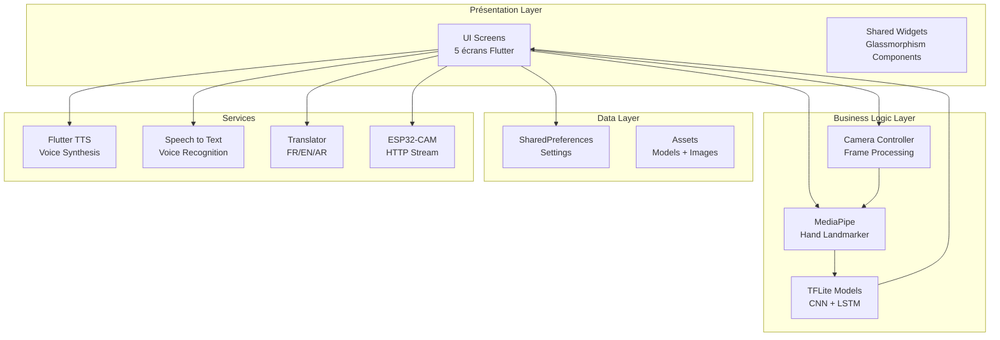

### Cas d'Utilisation

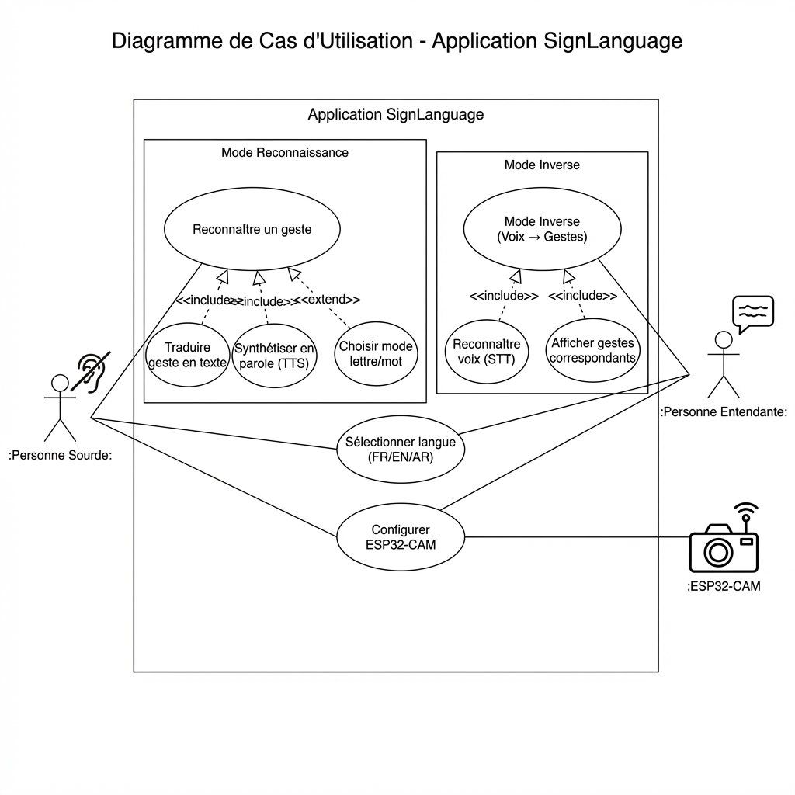

**Acteurs principaux** :

- 👤 **Utilisateur** : Personne sourde ou entendante utilisant l'app
- 📷 **ESP32-CAM** : Caméra externe optionnelle

**Cas d'utilisation** :

1. Détecter gestes de la main
2. Reconnaître lettres isolées
3. Reconnaître mots en  séquence
4. Traduire en parole (TTS)
5. Sélectionner langue de traduction
6. Mode inverse (Voix → Gestes)
7. Configurer ESP32-CAM

### Diagramme de Séquence - Mode Reconnaissance

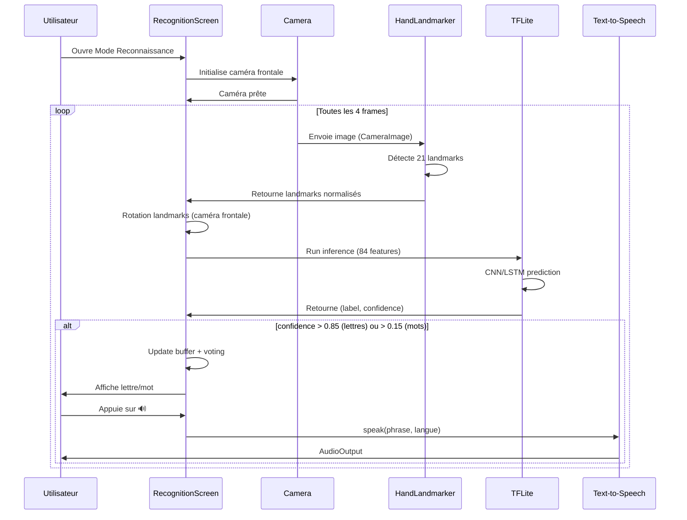

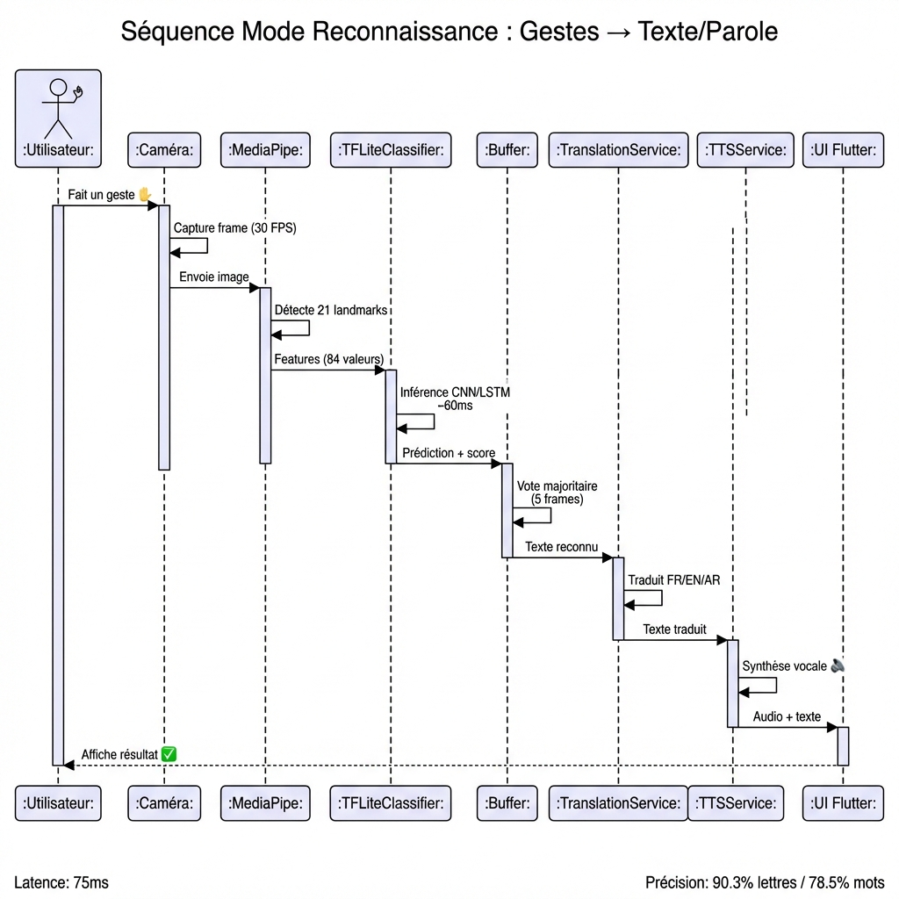

### Diagramme de Séquence - Mode Inverse

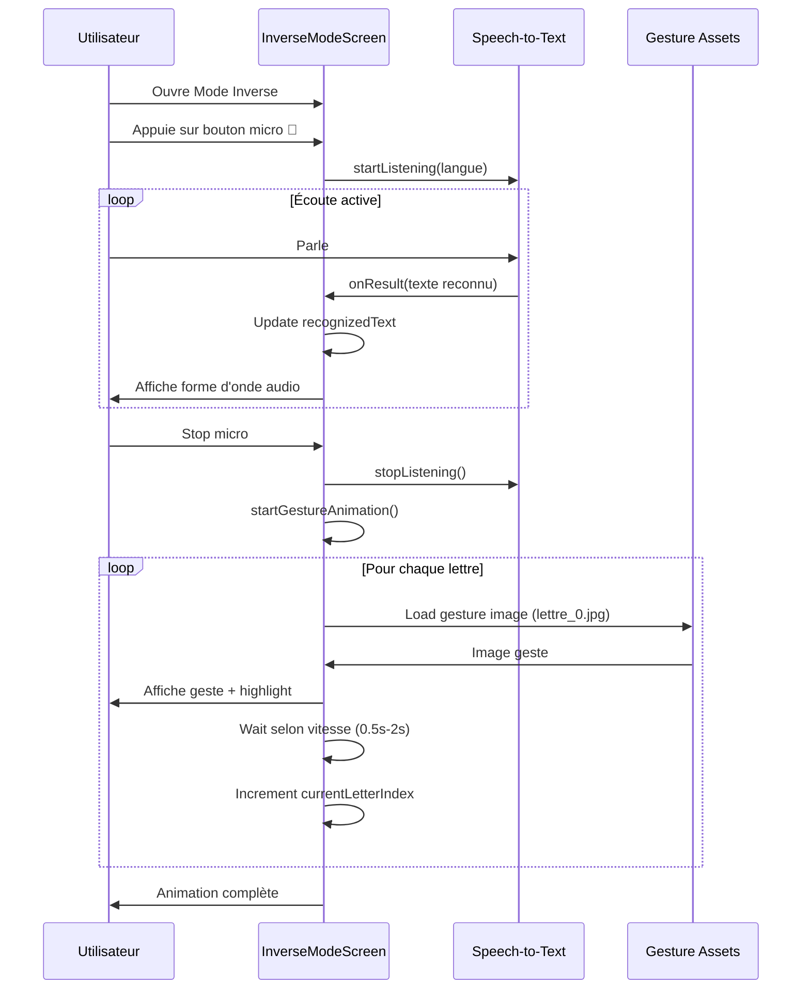

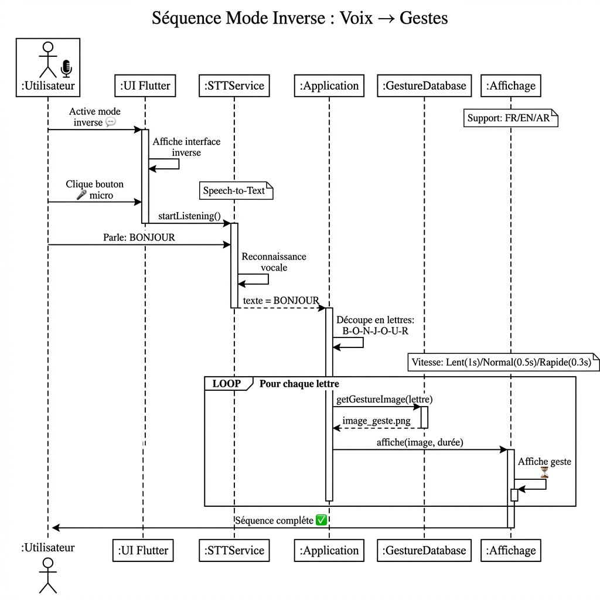

### Diagramme de Classes

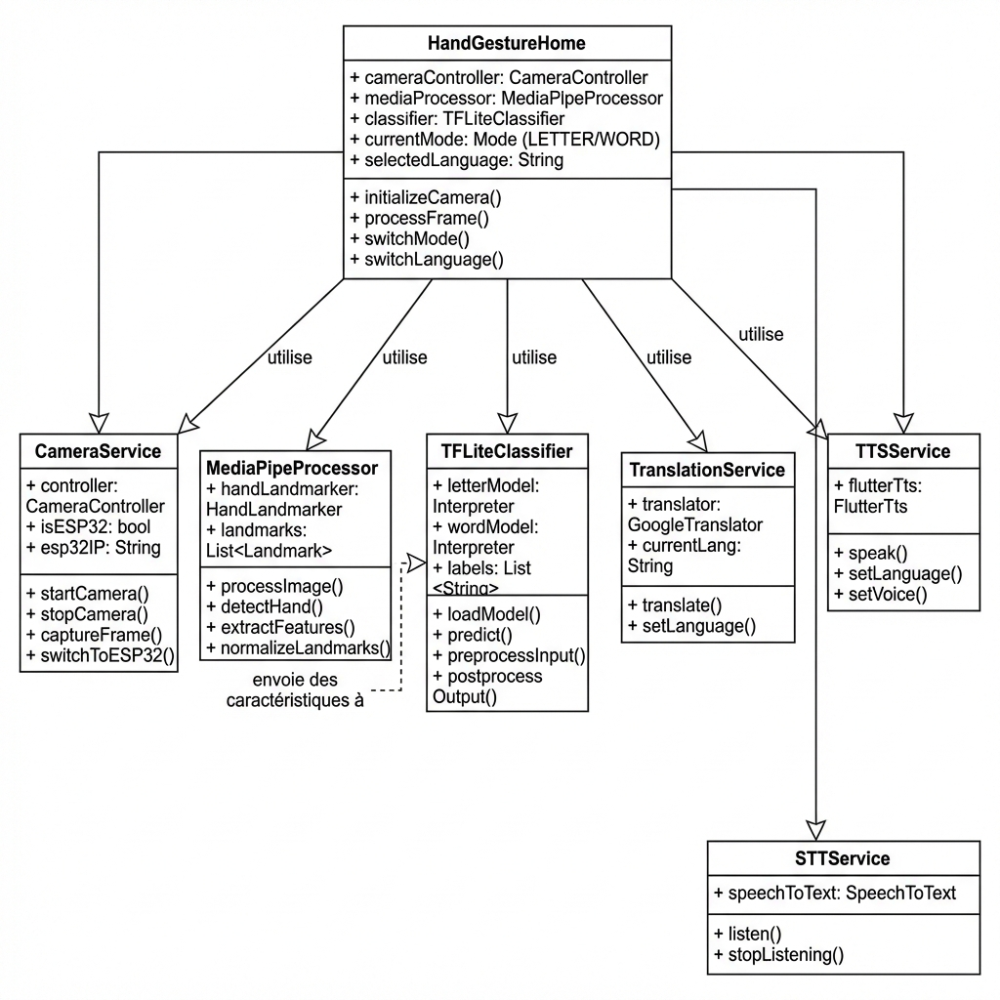

**Classes principales** :

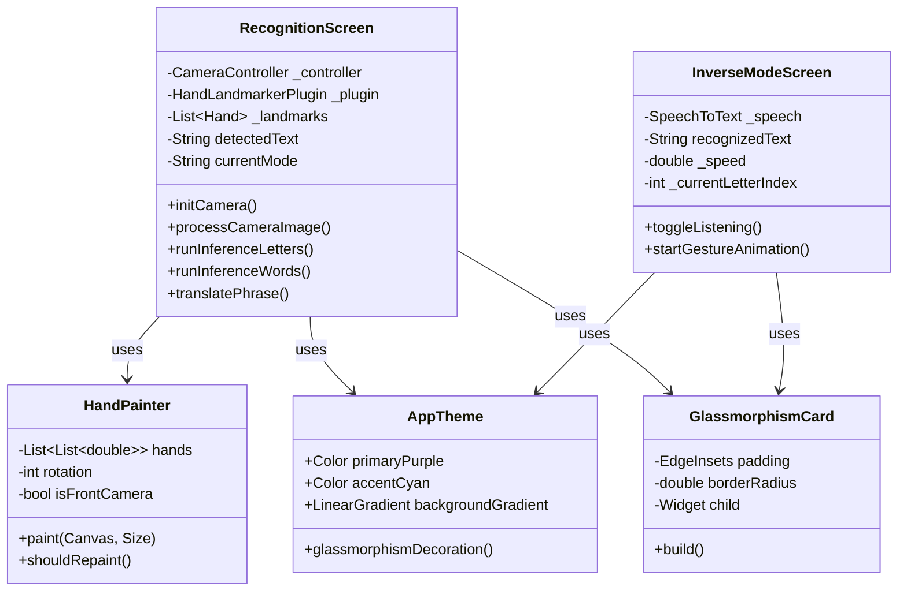

### Architecture On-Device

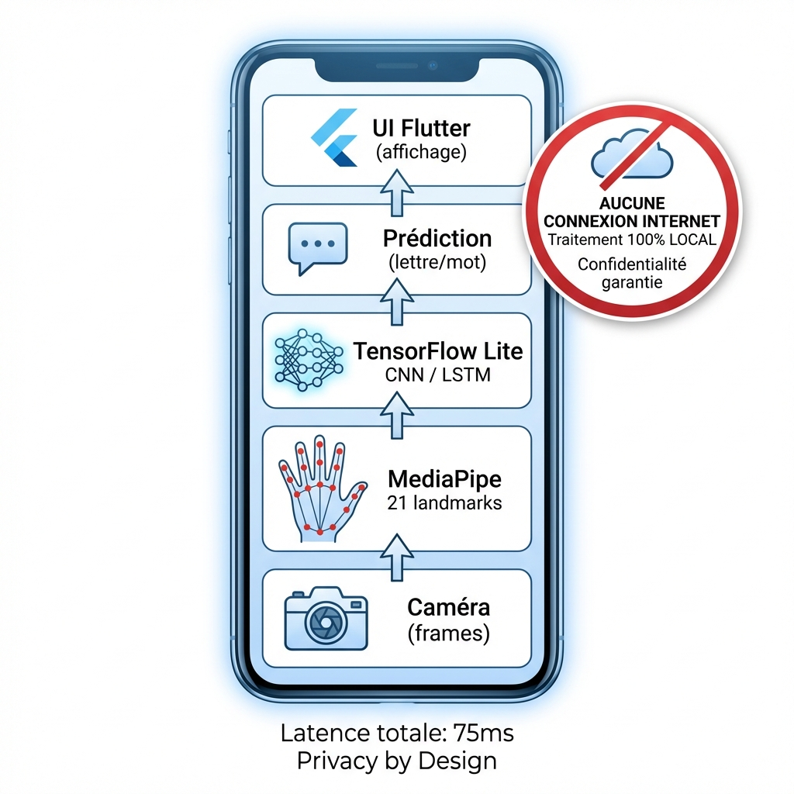

**Pipeline de traitement** :

1. **Capture** : CameraController (ResolutionPreset.low pour performance)
2. **Détection** : MediaPipe Hand Landmarker (21 points × 2 mains)
3. **Normalisation** : Rotation + tri + normalisation des landmarks
4. **Inférence** : TFLite (CNN pour lettres, LSTM pour mots)
5. **Post-traitement** : Buffer voting + confidence thresholds
6. **Traduction** : Translator FR/EN/AR
7. **Sortie** : TTS multilingue

### Pipeline de Données

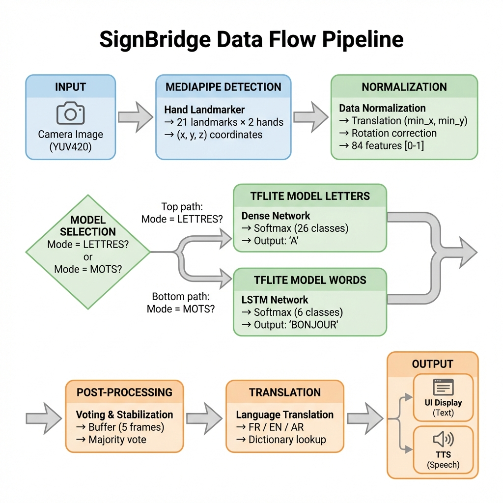

### Métriques de Performance

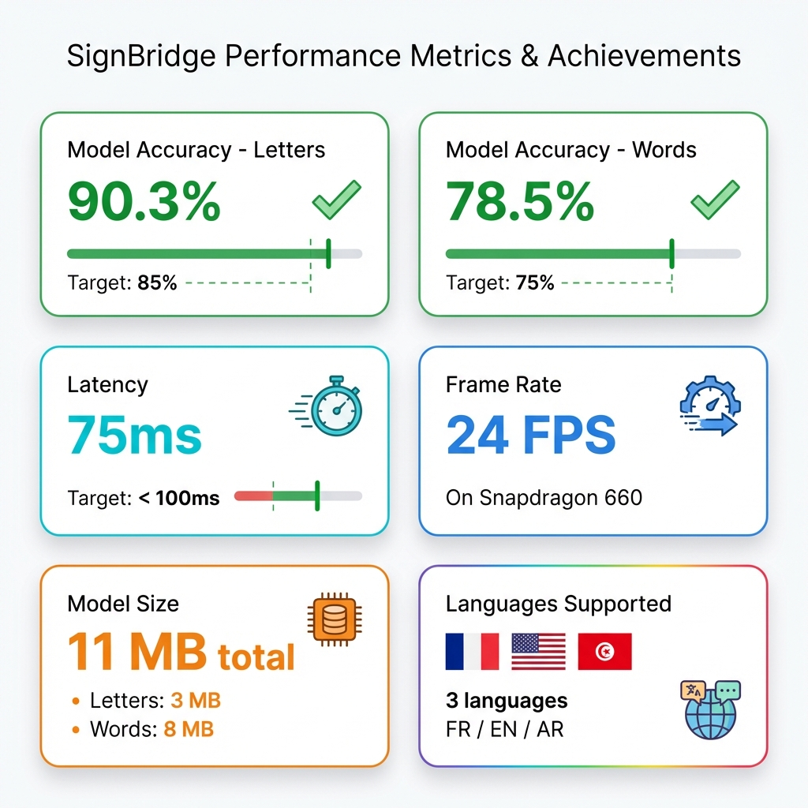

**Optimisations** :

- ✅ Frame skipping (process every 4th frame)
- ✅ Résolution caméra basse (low preset)
- ✅ Buffer voting (5 frames) pour stabilité
- ✅ Thresholds adaptatifs (0.85 lettres, 0.15 mots)
- ✅ Cooldown entre détections (1.5s)

---

## 📦 Installation

### Prérequis

- Flutter SDK 3.16 ou supérieur
- Android Studio / VS Code
- Appareil Android (API 21+) ou émulateur

### Étapes

1. **Cloner le dépôt**

```bash
git clone https://github.com/doosr/SignLanguageApp_Build.git
cd SignLanguageApp_Build
```

1. **Installer les dépendances Flutter**

```bash
cd flutter_app
flutter pub get
```

1. **Vérifier les assets**

Les modèles TFLite et images de gestes sont dans `flutter_app/assets/` :

- `model_letters.tflite` (classificateur lettres)
- `model_words.tflite` (classificateur mots)
- `model_letters_labels.txt`
- `model_words_labels.txt`
- `gestures/*_0.jpg` (images des gestes A-Z)

1. **Build et exécution**

```bash
# Build APK debug
flutter build apk --debug

# Ou run en mode développement
flutter run

# Build APK release (production)
flutter build apk --release --no-tree-shake-icons
```

## 🔬 Collecte de Données et Entraînement

### 1. Créer le Dataset

```bash
python create_dataset.py
# Suivez les instructions pour enregistrer les gestes
# Génère: data.pickle (3000+ échantillons)
```

### 2. Entraîner les Modèles

```bash
python train_classifier.py
# Génère: model_letters.tflite (90.3% précision)
#         model_words.tflite (78.5% précision)
```

### 3. Tester l'Inférence

```bash
python inference_classifier.py  # Mode lettres
python inference_sequence.py    # Mode mots
```

## 📁 Structure du Projet

```
SignLanguageApp_Build/
├── flutter_app/                    # Application mobile Flutter
│   ├── lib/
│   │   ├── main.dart              # Point d'entrée + navigation
│   │   ├── screens/               # 5 écrans de l'app
│   │   │   ├── home_screen.dart
│   │   │   ├── recognition_screen.dart
│   │   │   ├── inverse_mode_screen.dart
│   │   │   ├── language_selection_screen.dart
│   │   │   └── esp32_config_screen.dart
│   │   ├── widgets/               # Composants réutilisables
│   │   │   ├── glassmorphism_card.dart
│   │   │   ├── gradient_button.dart
│   │   │   ├── language_flag_button.dart
│   │   │   └── hand_painter.dart
│   │   └── theme/
│   │       └── app_theme.dart     # Design system
│   ├── assets/                    # Modèles TFLite + images
│   │   ├── model_letters.tflite
│   │   ├── model_words.tflite
│   │   ├── model_letters_labels.txt
│   │   ├── model_words_labels.txt
│   │   └── gestures/              # Images A-Z
│   ├── android/                   # Configuration Android
│   └── pubspec.yaml               # Dépendances
├── esp32_cam/                     # Firmware ESP32-CAM
│   └── esp32_cam_stream.ino
├── interface_screenshots/         # Mockups des écrans
│   ├── Figure_23_Home_Screen.png
│   ├── Figure_24_Recognition_Mode.png
│   ├── Figure_25_Inverse_Mode.png
│   ├── Figure_26_Language_Selection.png
│   └── Figure_27_ESP32_Config.png
├── create_dataset.py              # Collecte de données
├── train_classifier.py            # Entraînement modèles
├── inference_classifier.py        # Test lettres
├── inference_sequence.py          # Test mots
├── INTERFACE_MODERNE.md           # Documentation UI
└── README.md
```

## 🌍 Mots-clés

`Langue des signes` • `Intelligence artificielle` • `Flutter` • `MediaPipe` • `TensorFlow Lite` • `Accessibilité` • `IoT` • `ESP32-CAM` • `Reconnaissance gestuelle` • `Vision par ordinateur` • `Inclusion sociale` • `Application mobile` • `Temps réel` • `On-device AI` • `Glassmorphisme` • `UI/UX` • `Speech-to-Text` • `Text-to-Speech`

## 📊 Utilisation

### Mode Reconnaissance

1. Ouvrir l'app **SignLanguage**
2. Sur l'écran d'accueil, appuyer sur **"Mode Reconnaissance"** 🔤
3. Sélectionner le mode : **Lettres** (alphabet) ou **Mots** (vocabulaire)
4. Choisir la langue de sortie : 🇫🇷 FR / 🇬🇧 EN / 🇹🇳 AR
5. Faire des gestes devant la **caméra frontale**
6. La traduction s'affiche en **temps réel**
7. Appuyer sur 🔊 pour **écouter** la synthèse vocale

### Mode Inverse

1. Sur l'écran d'accueil, appuyer sur **"Mode Inverse"** 💬
2. Appuyer sur le **bouton micro** 🎤
3. **Parler** ou **dicter** le texte
4. Les gestes correspondants s'affichent **séquentiellement**
5. Régler la **vitesse** (Lent/Normal/Rapide)

## 🏆 Impact Social

- **100 000 personnes sourdes** en Tunisie peuvent bénéficier de cette solution
- **Gratuit et accessible** : pas besoin d'interprète (coût : 50-100 DT/heure)
- **Support de l'arabe** : innovation rare pour la communauté maghrébine
- **On-device AI** : fonctionne sans internet
- **Interface accessible** : emojis et design intuitif pour faciliter l'usage
- **Mode bidirectionnel** : communication dans les deux sens

## 🚀 CI/CD avec GitHub Actions

### Build Automatique

Le projet utilise **GitHub Actions** pour build automatiquement l'APK à chaque push :

```yaml
# .github/workflows/flutter-build.yml
- Build APK debug et release
- Tests automatiques
- Upload de l'APK en artifact
```

### Télécharger l'APK

1. Aller dans l'onglet **Actions** sur GitHub
2. Sélectionner le dernier workflow réussi
3. Télécharger l'artifact **app-release.apk**
4. Installer sur votre appareil Android

## 🎯 Perspectives

### ✅ Réalisé (Janvier 2026)

- [x] Détection gestes en temps réel
- [x] Modèles CNN + LSTM performants
- [x] Support 3 langues (FR/EN/AR)
- [x] Interface moderne glassmorphisme
- [x] **Mode inverse : Voix → Gestes**
- [x] ESP32-CAM intégration
- [x] 5 écrans avec navigation fluide

### Court terme (3-6 mois)

- [ ] Extension vocabulaire (100 mots)
- [ ] Mode sombre/clair toggle
- [ ] Déploiement **Google Play Store**
- [ ] Tutorial interactif pour nouveaux utilisateurs
- [ ] Amélioration précision modèles (95%+)

### Moyen terme (6-12 mois)

- [ ] Reconnaissance **expressions faciales**
- [ ] Grammaire **LSF** (Langue des Signes Française)
- [ ] Déploiement **iOS** (App Store)
- [ ] Mode **hors-ligne complet**
- [ ] Partage de phrases traduites

### Long terme (1-2 ans)

- [ ] Reconnaissance **continue** (phrases complexes)
- [ ] **Réalité augmentée** (AR overlay)
- [ ] Support **ASL, BSL** et autres langues des signes
- [ ] **API cloud** pour traduction collaborative
- [ ] Communauté et dictionnaire collaboratif

## 📸 Captures d'Écran

<table>
  <tr>
    <td><br/><b>Accueil</b></td>
    <td><br/><b>Reconnaissance</b></td>
    <td><br/><b>Mode Inverse</b></td>
  </tr>
  <tr>
    <td><br/><b>Langues</b></td>
    <td><br/><b>ESP32-CAM</b></td>
    <td></td>
  </tr>
</table>

## 📄 Licence

MIT License - Libre d'utilisation et de modification

## 👨‍💻 Auteur

Projet réalisé dans le cadre d'un **stage de perfectionnement**  
📍 **Pépinière d'Entreprises APII Mahdia** (Janvier 2026)  
🎓 **ISET Mahdia** - DSI 2024-2025  

## 🙏 Remerciements

- **Pépinière d'Entreprises APII Mahdia** pour l'accueil et l'encadrement
- Programme **"startup APII"** (Janvier 2026)
- **ISET Mahdia** - Département DSI
- **Communauté sourde tunisienne** pour les retours et tests
- **Google MediaPipe Team** pour les outils de vision
- **Flutter Team** pour le framework exceptionnel

---

<p align="center">
  <b>SignLanguage</b> - Briser les barrières de la communication 🤟
</p>

<p align="center">
  Fait avec ❤️ en Tunisie 🇹🇳
</p>
