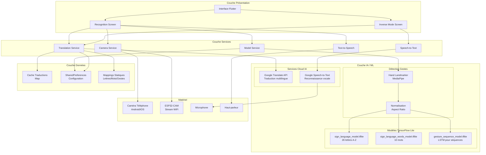

# Architecture Système - SignLanguage App

```mermaid
graph TB
    subgraph "Couche Présentation"
        UI[Interface Flutter]
        RS[Recognition Screen]
        IMS[Inverse Mode Screen]
    end
    
    subgraph "Couche Services"
        CS[Camera Service]
        MS[Model Service]
        TS[Translation Service]
        TTS[Text-to-Speech]
        STT[Speech-to-Text]
    end
    
    subgraph "Couche IA / ML"
        subgraph "Détection Gestes"
            HL[Hand Landmarker<br/>MediaPipe]
            NM[Normalisation<br/>Aspect Ratio]
        end
        
        subgraph "Modèles TensorFlow Lite"
            LM[sign_language_model.tflite<br/>26 lettres A-Z]
            WM[sign_language_words_model.tflite<br/>10 mots]
            SM[gesture_sequence_model.tflite<br/>LSTM pour séquences]
        end
        
        subgraph "Services Cloud IA"
            GTA[Google Translate API<br/>Traduction multilingue]
            GSTT[Google Speech-to-Text<br/>Reconnaissance vocale]
        end
    end
    
    subgraph "Couche Données"
        CACHE[Cache Traductions<br/>Map<String, String>]
        PREF[SharedPreferences<br/>Configuration]
        MAPS[Mappings Statiques<br/>Lettres/Mots/Gestes]
    end
    
    subgraph "Matériel"
        CAM[Caméra Téléphone<br/>Android/iOS]
        ESP[ESP32-CAM<br/>Stream WiFi]
        MIC[Microphone]
        SPK[Haut-parleur]
    end
    
    UI --> RS
    UI --> IMS
    RS --> CS
    RS --> MS
    RS --> TS
    RS --> TTS
    IMS --> STT
    IMS --> TS
    
    CS --> CAM
    CS --> ESP
    
    MS --> HL
    HL --> NM
    NM --> LM
    NM --> WM
    NM --> SM
    
    TS --> GTA
    TS --> CACHE
    TS --> MAPS
    
    STT --> GSTT
    GSTT --> MIC
    TTS --> SPK
    
    MS --> PREF
    TS --> PREF
```
