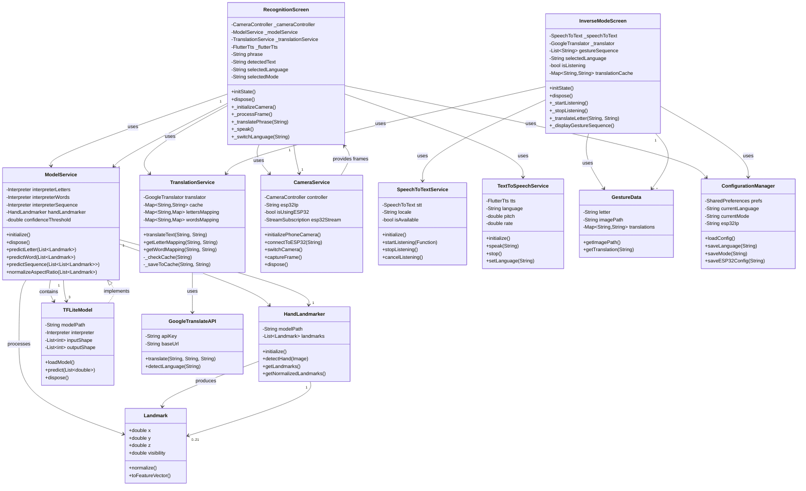

# Diagramme de Classes - SignLanguage App

## Description des Classes

### Classes d'Interface (UI)

- **RecognitionScreen** : Écran principal pour la reconnaissance de gestes
- **InverseModeScreen** : Écran pour le mode inverse (voix → gestes)

### Classes de Services

- **ModelService** : Gestion des modèles TensorFlow Lite
- **TranslationService** : Gestion des traductions multilingues
- **CameraService** : Gestion de la caméra (téléphone et ESP32)
- **SpeechToTextService** : Service de reconnaissance vocale
- **TextToSpeechService** : Service de synthèse vocale

### Classes d'IA/ML

- **HandLandmarker** : Détection des landmarks de la main (MediaPipe)
- **TFLiteModel** : Modèle TensorFlow Lite générique
- **Landmark** : Représentation d'un point caractéristique de la main

### Classes de Données

- **GestureData** : Données d'un geste (lettre, image, traductions)
- **ConfigurationManager** : Gestion de la configuration de l'app

### Classes API

- **GoogleTranslateAPI** : Interface avec l'API Google Translate
