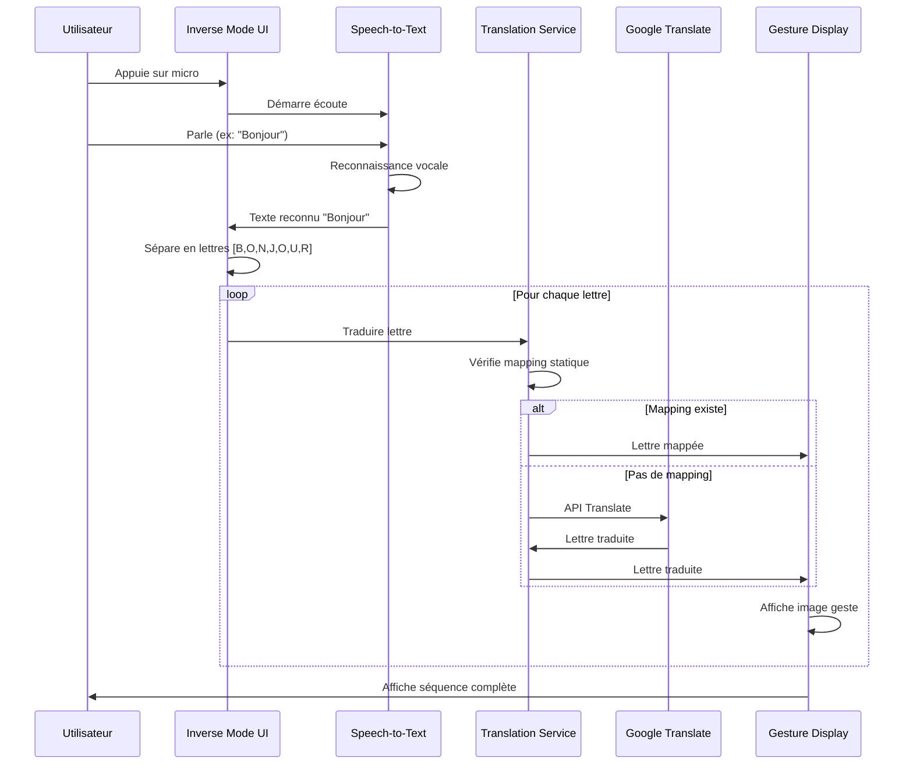

# Flux Mode Inverse (Voix → Gestes)

```mermaid
sequenceDiagram
    participant U as Utilisateur
    participant UI as Inverse Mode UI
    participant STT as Speech-to-Text
    participant TS as Translation Service
    participant GT as Google Translate
    participant UI2 as Gesture Display
    
    U->>UI: Appuie sur micro
    UI->>STT: Démarre écoute
    U->>STT: Parle (ex: "Bonjour")
    STT->>STT: Reconnaissance vocale
    STT->>UI: Texte reconnu "Bonjour"
    UI->>UI: Sépare en lettres [B,O,N,J,O,U,R]
    
    loop Pour chaque lettre
        UI->>TS: Traduire lettre
        TS->>TS: Vérifie mapping statique
        alt Mapping existe
            TS->>UI2: Lettre mappée
        else Pas de mapping
            TS->>GT: API Translate
            GT->>TS: Lettre traduite
            TS->>UI2: Lettre traduite
        end
        UI2->>UI2: Affiche image geste
    end
    
    UI2->>U: Affiche séquence complète
```
