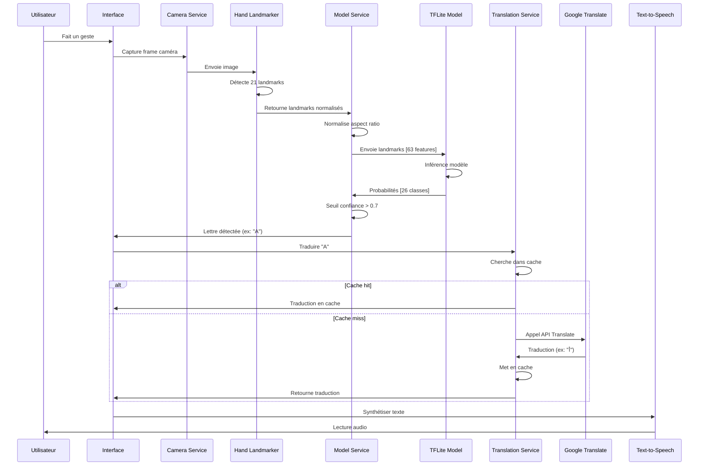

# Flux de Reconnaissance de Geste

```mermaid
sequenceDiagram
    participant U as Utilisateur
    participant UI as Interface
    participant CS as Camera Service
    participant HL as Hand Landmarker
    participant MS as Model Service
    participant TFL as TFLite Model
    participant TS as Translation Service
    participant GT as Google Translate
    participant TTS as Text-to-Speech
    
    U->>UI: Fait un geste
    UI->>CS: Capture frame caméra
    CS->>HL: Envoie image
    HL->>HL: Détecte 21 landmarks
    HL->>MS: Retourne landmarks normalisés
    MS->>MS: Normalise aspect ratio
    MS->>TFL: Envoie landmarks [63 features]
    TFL->>TFL: Inférence modèle
    TFL->>MS: Probabilités [26 classes]
    MS->>MS: Seuil confiance > 0.7
    MS->>UI: Lettre détectée (ex: "A")
    UI->>TS: Traduire "A"
    TS->>TS: Cherche dans cache
    alt Cache hit
        TS->>UI: Traduction en cache
    else Cache miss
        TS->>GT: Appel API Translate
        GT->>TS: Traduction (ex: "أ")
        TS->>TS: Met en cache
        TS->>UI: Retourne traduction
    end
    UI->>TTS: Synthétiser texte
    TTS->>U: Lecture audio
```
