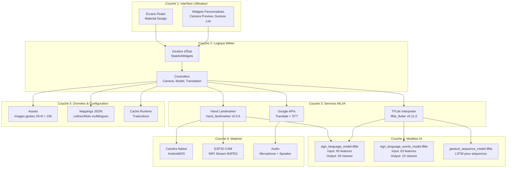

# Architecture en Couches

```mermaid
graph TB
    subgraph "Couche 1: Interface Utilisateur"
        A1[Écrans Flutter<br/>Material Design]
        A2[Widgets Personnalisés<br/>Camera Preview, Gesture List]
    end
    
    subgraph "Couche 2: Logique Métier"
        B1[Gestion d'État<br/>StatefulWidgets]
        B2[Controllers<br/>Camera, Model, Translation]
    end
    
    subgraph "Couche 3: Services ML/IA"
        C1[Hand Landmarker<br/>hand_landmarker v0.0.6]
        C2[TFLite Interpreter<br/>tflite_flutter v0.11.0]
        C3[Google APIs<br/>Translate + STT]
    end
    
    subgraph "Couche 4: Modèles IA"
        D1[sign_language_model.tflite<br/>Input: 63 features<br/>Output: 26 classes]
        D2[sign_language_words_model.tflite<br/>Input: 63 features<br/>Output: 10 classes]
        D3[gesture_sequence_model.tflite<br/>LSTM pour séquences]
    end
    
    subgraph "Couche 5: Données & Configuration"
        E1[Assets<br/>Images gestes 26×6 = 156]
        E2[Mappings JSON<br/>Lettres/Mots multilingues]
        E3[Cache Runtime<br/>Traductions]
    end
    
    subgraph "Couche 6: Matériel"
        F1[Caméra Native<br/>Android/iOS]
        F2[ESP32-CAM<br/>WiFi Stream MJPEG]
        F3[Audio<br/>Microphone + Speaker]
    end
    
    A1 --> B1
    A2 --> B1
    B1 --> B2
    B2 --> C1
    B2 --> C2
    B2 --> C3
    C1 --> D1
    C2 --> D1
    C2 --> D2
    C2 --> D3
    B2 --> E1
    B2 --> E2
    B2 --> E3
    C1 --> F1
    C1 --> F2
    C3 --> F3
```
