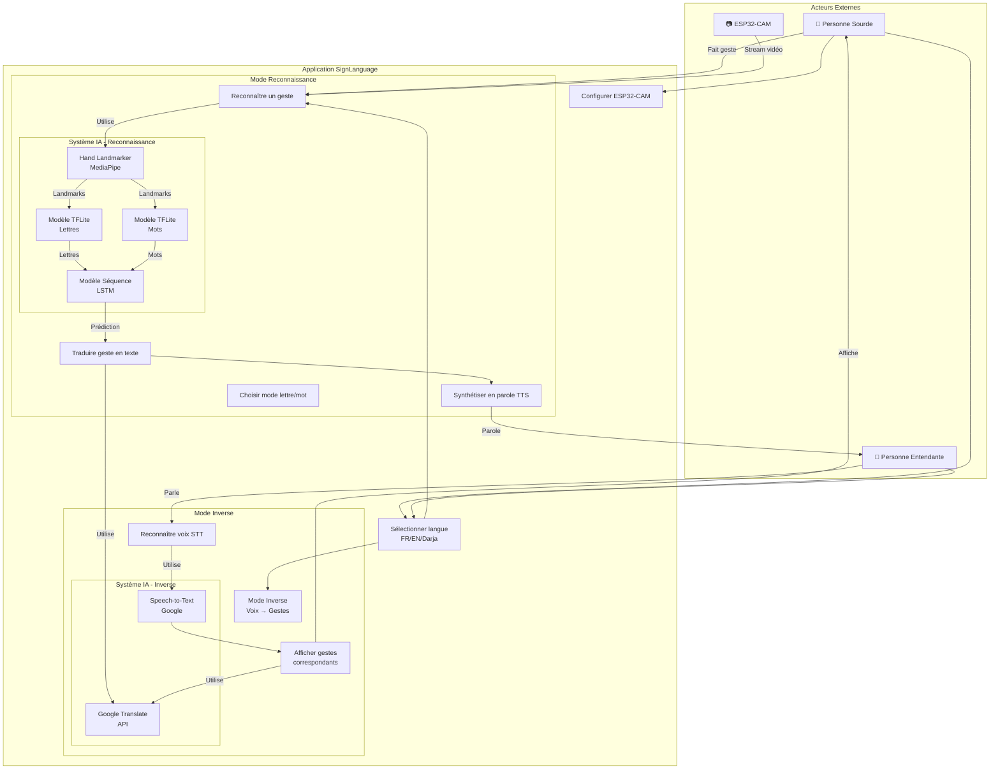

# Diagramme de Cas d'Utilisation - SignLanguage App

```mermaid
graph TB
    subgraph "Acteurs Externes"
        PS[👤 Personne Sourde]
        PE[👤 Personne Entendante]
        ESP32[📷 ESP32-CAM]
    end
    
    subgraph "Application SignLanguage"
        subgraph "Mode Reconnaissance"
            RG[Reconnaître un geste]
            TG[Traduire geste en texte]
            SY[Synthétiser en parole TTS]
            CM[Choisir mode lettre/mot]
            
            subgraph "Système IA - Reconnaissance"
                HL[Hand Landmarker<br/>MediaPipe]
                TFL1[Modèle TFLite<br/>Lettres]
                TFL2[Modèle TFLite<br/>Mots]
                SEQ[Modèle Séquence<br/>LSTM]
            end
        end
        
        subgraph "Mode Inverse"
            MI[Mode Inverse<br/>Voix → Gestes]
            RV[Reconnaître voix STT]
            AG[Afficher gestes<br/>correspondants]
            
            subgraph "Système IA - Inverse"
                STT[Speech-to-Text<br/>Google]
                GT[Google Translate<br/>API]
            end
        end
        
        SL[Sélectionner langue<br/>FR/EN/Darja]
        CE[Configurer ESP32-CAM]
    end
    
    PS -->|Fait geste| RG
    RG -->|Utilise| HL
    HL -->|Landmarks| TFL1
    HL -->|Landmarks| TFL2
    TFL1 -->|Lettres| SEQ
    TFL2 -->|Mots| SEQ
    SEQ -->|Prédiction| TG
    TG -->|Utilise| GT
    TG --> SY
    SY -->|Parole| PE
    
    PE -->|Parle| RV
    RV -->|Utilise| STT
    STT --> AG
    AG -->|Utilise| GT
    AG -->|Affiche| PS
    
    PS --> SL
    PE --> SL
    SL --> RG
    SL --> MI
    
    PS --> CE
    ESP32 -->|Stream vidéo| RG
```
