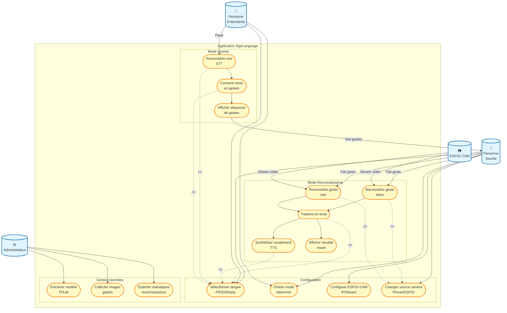

# Diagramme de Cas d'Utilisation Complet - SignLanguage App

## Description des Cas d'Utilisation

### Mode Reconnaissance

- **UC1 - Reconnaître geste lettre** : Détecte et identifie une lettre de l'alphabet en langage des signes (A-Z)
- **UC2 - Reconnaître geste mot** : Détecte et identifie un mot complet en langage des signes (HELLO, THANK YOU, etc.)
- **UC3 - Traduire en texte** : Convertit le geste reconnu en texte dans la langue sélectionnée
- **UC4 - Synthétiser vocalement** : Lit le texte traduit à voix haute via TTS
- **UC5 - Afficher résultat visuel** : Affiche le résultat à l'écran avec animations

### Mode Inverse

- **UC6 - Reconnaître voix** : Capture et transcrit la parole en texte via Speech-to-Text
- **UC7 - Convertir texte en gestes** : Transforme chaque lettre du texte en geste correspondant
- **UC8 - Afficher séquence de gestes** : Affiche les images des gestes en séquence

### Configuration

- **UC9 - Sélectionner langue** : Choix entre Français, Anglais, ou Arabe
- **UC10 - Choisir mode** : Sélection du mode reconnaissance (lettres ou mots)
- **UC11 - Configurer ESP32-CAM** : Configuration de l'IP et du stream de l'ESP32-CAM
- **UC12 - Changer source caméra** : Basculer entre caméra du téléphone et ESP32-CAM

### Gestion Données (Admin)

- **UC13 - Entraîner modèle** : Entraîner les modèles TensorFlow Lite avec nouvelles données
- **UC14 - Collecter images** : Capturer des images de gestes pour enrichir le dataset
- **UC15 - Exporter statistiques** : Générer des rapports sur les performances de reconnaissance
