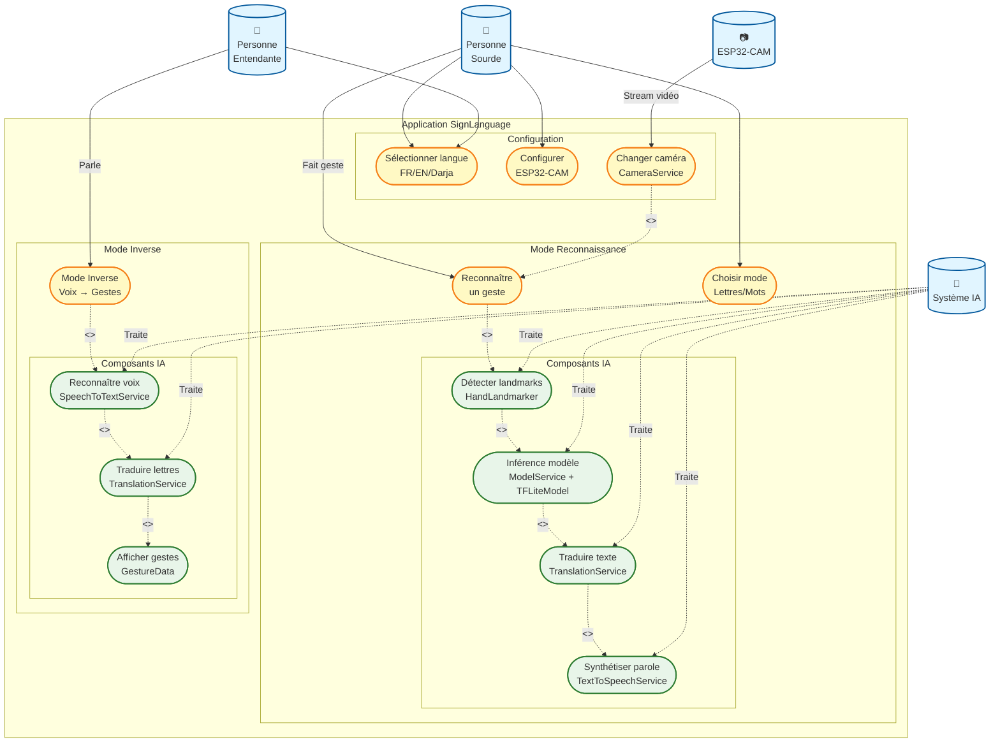

# Diagramme de Cas d'Utilisation Corrigé - SignLanguage App

## Légende

### Acteurs

- **Personne Sourde** : Utilise le mode reconnaissance (geste → texte/parole)
- **Personne Entendante** : Utilise le mode inverse (voix → gestes)
- **ESP32-CAM** : Caméra WiFi pour capture à distance
- **Système IA** : Composants d'intelligence artificielle

### Cas d'Utilisation Principaux

**Mode Reconnaissance** :

- UC1 : Reconnaître un geste
- UC2 : Choisir mode (Lettres A-Z ou Mots)

**Composants IA - Reconnaissance** :

- UC3 : Détecter landmarks (HandLandmarker MediaPipe - 21 points)
- UC4 : Inférence modèle (ModelService + TFLiteModel)
- UC5 : Traduire texte (TranslationService + GoogleTranslateAPI)
- UC6 : Synthétiser parole (TextToSpeechService)

**Mode Inverse** :

- UC7 : Mode Inverse (Voix → Gestes)

**Composants IA - Mode Inverse** :

- UC8 : Reconnaître voix (SpeechToTextService)
- UC9 : Traduire lettres (TranslationService)
- UC10 : Afficher gestes (GestureData - 156 images)

**Configuration** :

- UC11 : Sélectionner langue (FR/EN/Darja)
- UC12 : Configurer ESP32-CAM
- UC13 : Changer source caméra (CameraService)

### Relations

- **Flèches pleines** : Association acteur → cas d'utilisation
- **Flèches pointillées** : Relations <<include>> et <<extend>>
- **Couleurs** :
  - Bleu : Acteurs
  - Jaune : Cas d'utilisation principaux
  - Vert : Composants IA
