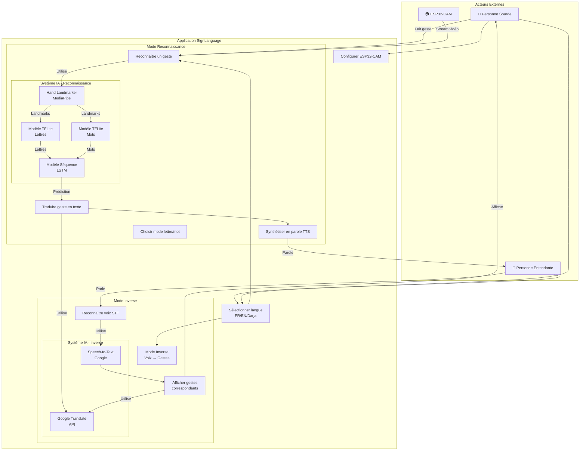
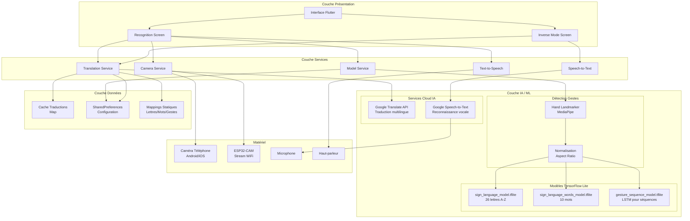
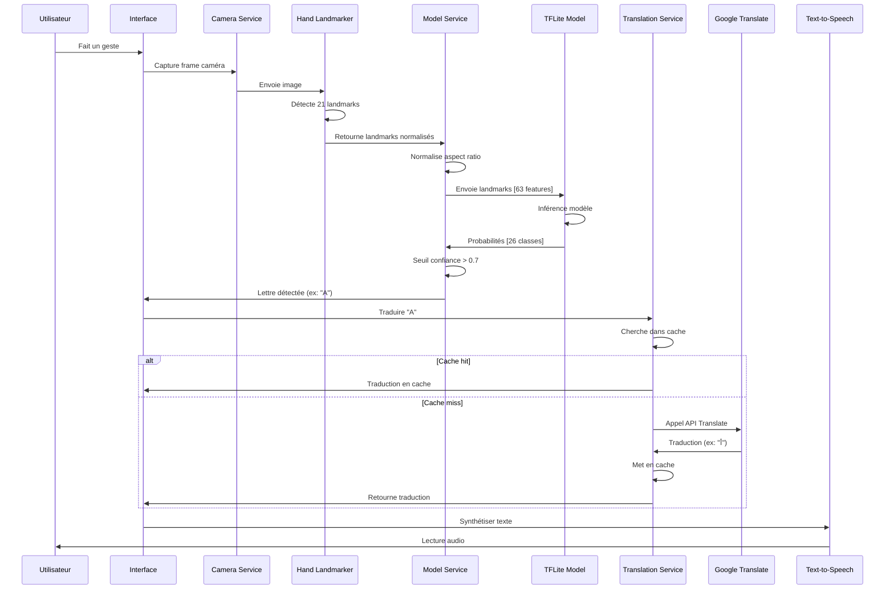
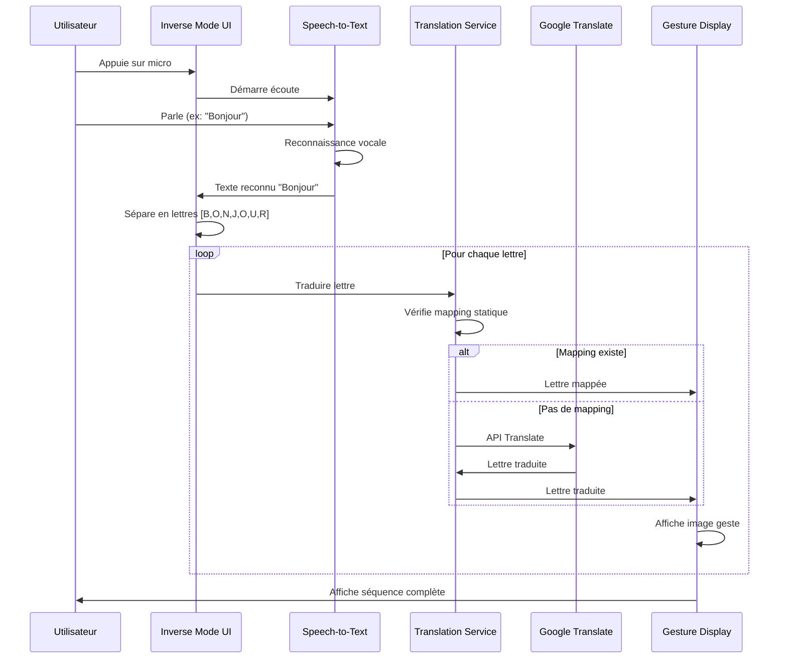
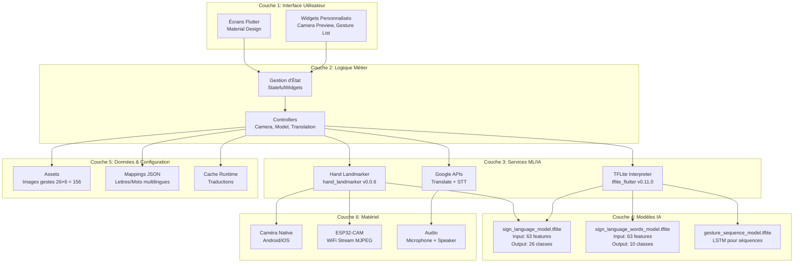

# Diagrammes d'Architecture - SignLanguage App

## Diagramme de Cas d'Utilisation Amélioré



## Architecture Système avec Composants IA



## Flux de Données - Reconnaissance de Geste



## Flux de Données - Mode Inverse (Voix → Gestes)



## Architecture en Couches



## Composants IA - Détails Techniques

### 1. Hand Landmarker (MediaPipe)

- **Version**: hand_landmarker v0.0.6
- **Fonction**: Détecte 21 points caractéristiques de la main
- **Input**: Image RGB (variable)
- **Output**: 21 landmarks (x, y, z) + score confiance
- **Normalisation**: Coordonnées [0-1] relatives à la frame

### 2. Modèles TensorFlow Lite

#### sign_language_model.tflite

- **Type**: Dense Neural Network
- **Input Shape**: [1, 63] (21 landmarks × 3 coordonnées)
- **Output Shape**: [1, 26] (A-Z)
- **Activation**: Softmax
- **Taille**: ~50 KB
- **Entraîné sur**: Dataset custom avec variabilité

#### sign_language_words_model.tflite

- **Type**: Dense Neural Network
- **Input Shape**: [1, 63]
- **Output Shape**: [1, 10] (10 mots courants)
- **Mots**: HELLO, THANK YOU, PLEASE, etc.
- **Taille**: ~45 KB

#### gesture_sequence_model.tflite

- **Type**: LSTM (Long Short-Term Memory)
- **Input Shape**: [1, sequence_length, 63]
- **Output**: Séquence de lettres/mots
- **Usage**: Reconnaissance de phrases complètes
- **Taille**: ~120 KB

### 3. Services Cloud IA

#### Google Translate API

- **Usage**: Traduction multilingue (FR ↔ EN ↔ AR-TN)
- **Fallback**: Mappings statiques
- **Cache**: Map en mémoire pour éviter appels répétés
- **Latence**: ~200-500ms par requête

#### Google Speech-to-Text

- **Langues**: Français, Anglais, Arabe Tunisien
- **Mode**: Streaming ou one-shot
- **Précision**: ~95% en conditions normales
- **Usage**: Mode Inverse uniquement

## Optimisations IA Implémentées

### Normalisation Aspect Ratio

```dart
// Compensation aspect ratio pour mobile
double aspectRatio = frameWidth / frameHeight;
for (var landmark in landmarks) {
  landmark.x *= aspectRatio;
  // Normalisation pour TFLite
}
```

### Seuil de Confiance Adaptatif

```dart
double confidenceThreshold = mode == 'letters' ? 0.7 : 0.75;
if (prediction.confidence > confidenceThreshold) {
  // Accepter la prédiction
}
```

### Cache de Traductions

```dart
Map<String, String> _translationCache = {};
String cacheKey = '${letter}_${targetLang}';
if (_translationCache.containsKey(cacheKey)) {
  return _translationCache[cacheKey]!; // Hit
}
```

---

**Diagrammes créés avec Mermaid.js** - Compatible GitHub, Markdown, et outils de documentation
